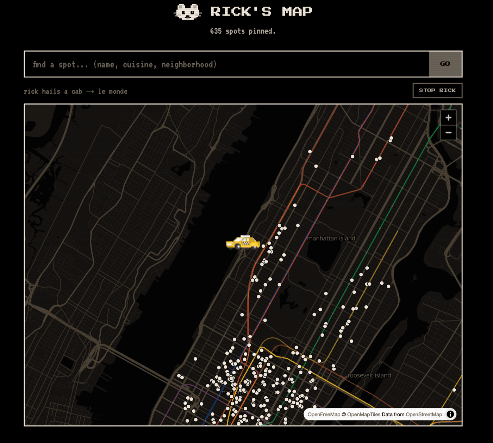

# 🐀 Rick's Map

**[nycrestaurantweek.app](https://nycrestaurantweek.app)** — every NYC Restaurant Week restaurant on one map, plus a pixel rat who rides the actual subway to whichever one you pick.



Restaurant Week Summer 2026 runs **Jul 20 – Sep 6** with **636** participating restaurants. The official site is an endless scroll. This one isn't.

## ✨ What it does

- 🗺️ **Map** — real NYC cartography with the subway lines drawn in
- 🚇 **Rick** — walks, Citibikes, cabs, or takes the train to your pick. The track geometry is real, and the subway car gets repainted in the route color
- 💬 **Ask Rick** — *"$30 omakase in brooklyn, open sunday"*
- 🔌 **MCP server** — the same data, for Claude or any MCP client

## 🔌 MCP server

No auth, no API key, one line:

```sh
claude mcp add --transport http nyc-restaurant-week https://nycrestaurantweek.app/mcp
```

| Tool | What it does |
|---|---|
| `search_restaurants` | Filter by cuisine, borough, neighborhood, price, meal, week, date, or collection. Paginated. |
| `get_restaurant` | Full detail by slug or name — menu PDF, website, OpenTable link. |
| `check_date` | Is Restaurant Week on that day? Which week? Saturday/Sunday rules. |
| `list_filters` | Every filter value, with live participant counts. |

## 🛠️ How it works

No database. All 636 restaurants live in `data/restaurants.json` (509 KB) and get bundled into the serverless function at build time.

| Piece | Built with |
|---|---|
| 🗺️ Map | MapLibre + [OpenFreeMap](https://openfreemap.org) tiles |
| 🚇 Subway | Real MTA geometry in `public/subway.json` — nearest-station lookup, direct or one-transfer rides, sliced along the true track |
| 🐀 Rick | Hand-drawn pixel art, rendered as SVG rects |
| 🚕 Street legs | OSRM, with a straight-line fallback when it times out |
| 💬 Chat | Haiku via the AI Gateway, degrading to plain keyword search if the gateway falls over |

## 🏃 Run it

```sh
npm install
npm run dev      # site on :3000, MCP at localhost:3000/mcp
npm run scrape   # refresh the restaurant data
```

## 📋 Data

From the public program API behind [nyctourism.com/restaurant-week](https://www.nyctourism.com/restaurant-week/) — the same JSON their own browser client fetches.

---

🐀 *Unofficial fan project. Not affiliated with NYC Tourism + Conventions or NYC Restaurant Week®. Prices and participation change — always confirm with the restaurant.*
